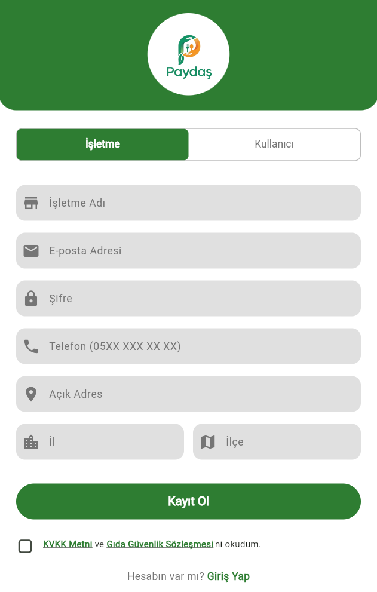

# Paydaş (Askıda Yemek Uygulaması)

Paydaş, toplumsal dayanışmayı artırmak amacıyla geliştirilmiş, ihtiyaç sahipleri ile hayırseverleri ve işletmeleri buluşturan bir "Askıda Yemek" platformudur. Bu uygulama sayesinde kullanıcılar restoranlardan yemek bağışında bulunabilir (askıya bırakabilir). Restoranlar isterse kendileri de askıya ürün ekleyebilir; ihtiyaç sahipleri ise bu bağışlardan faydalanabilir. Ayrıca Muhtarlar aracılığıyla ihtiyaç sahiplerinin tespiti ve sisteme kaydı sağlanır.

## 📱 Özellikler

Uygulama 3 temel kullanıcı rolü üzerine kurgulanmıştır:

### 1. Kullanıcılar (Hayırseverler & İhtiyaç Sahipleri)
*   **Kayıt ve Giriş:** E-posta doğrulama ve şifre ile kayıt.
*   **Restoranları Görüntüleme:** Konum tabanlı veya liste şeklinde anlaşmalı restoranları görme.
*   **Bağış Yapma (Askıya Bırakma):** Restoran menüsünden ürün seçip ödeme yaparak askıya bırakma.
*   **Rezervasyon (Askıdan Alma):** İhtiyaç sahipleri, askıdaki ürünleri belirli bir süre için rezerve edip restoranlardan sağladığımız kod ile temin edebilir.
*   **Profil Yönetimi:** Kişisel bilgileri (Adres, Telefon vb.) düzenleme, geçmiş bağış ve rezervasyonları görüntüleme.

### 2. İşletmeler (Restoranlar)
*   **Profil Yönetimi:** İşletme bilgilerini (Adres, Telefon, Çalışma Saatleri) düzenleme.
*   **Menü Yönetimi:** Kategori ve ürün bazlı menü oluşturma, düzenleme ve silme.
*   **Kurumsal Bağış:** İşletmeler, müşterileri beklemeden kendi ürünlerini de askıya ekleyerek bağışta bulunabilirler.
*   **Sipariş Takibi:**
    *   **Askıya Eklenenler:** Kullanıcılar veya işletme tarafından bağışlanan ve bekleyen ürünleri görme.
    *   **Teslim Edilenler:** Müşteriye teslim edilen ürünlerin takibi (Arka planda istatistik olarak tutulur).
*   **Kod Doğrulama:** Müşterinin getirdiği rezervasyon kodunu doğrulayarak işlemi onaylama ve stoğu güncelleme.

### 3. Muhtarlar
*   **Başvuru Yönetimi:** İhtiyaç sahibi vatandaşların başvurularını sisteme kaydetme.
*   **Başvuru Listeleme:** Kayıtlı başvuruları ve detaylarını görüntüleme.
*   **Yetkilendirme:** Sadece yetkili muhtarlar giriş yapabilir.

## 🔮 Gelecek Planları

Projenin geliştirilme sürecinde planlanan özellikler ve yenilikler:

*   **Favori Restoranlar:** Kullanıcıların sık tercih ettiği restoranları favorilerine ekleyebilmesi.
*   **Telekomünikasyon İşbirliği:** Bir telekomünikasyon şirketiyle anlaşarak, Muhtarın sisteme kaydettiği ihtiyaç sahiplerinin, sağlanan özel bir numaraya ulaşarak ihtiyaçlarının giderilmesinin sağlanması.
*   **Gelişmiş İstatistikler:** Kullanıcı, işletme ve genel sistem bazında daha detaylı veri analizleri ve raporlamalar.

## 👥 Proje Ekibi

Bu proje, güçlü bir ekip çalışmasının ürünüdür:

*   **Fahri Gündüz** - Proje Koordinatörü
*   **Mustafa KURÇ** - UI/UX Tasarımı
*   **Enver YAKUT** - Frontend, Backend
*   **Sefa SEZER** - Frontend, Backend

## 🛠 Kullanılan Teknolojiler ve Paketler

Proje **Flutter** framework'ü kullanılarak geliştirilmiştir ve backend tarafında **Firebase** servislerinden yararlanmaktadır.

### Temel Teknolojiler
*   **Frontend:** Flutter (Dart)
*   **Backend:** Firebase (Auth, Firestore)
*   **Database:** Cloud Firestore

### Önemli Kütüphaneler (Paketler)
*   `firebase_core`, `firebase_auth`: Kimlik doğrulama.
*   `cloud_firestore`: Veritabanı işlemleri.
*   `shared_preferences`: Yerel veri saklama.
*   `flutter_map`, `latlong2`: Harita entegrasyonu.
*   `geolocator`: Konum servisi.
*   `geocoding`: Adres işlemleri.

## 🚀 Kurulum

Projeyi yerel ortamınızda çalıştırmak için:

1.  **Depoyu Klonlayın:**
    ```bash
    git clone https://github.com/kullaniciadi/paydas.git
    cd paydas
    ```

2.  **Bağımlılıkları Yükleyin:**
    ```bash
    flutter pub get
    ```

3.  **Firebase Yapılandırması:**
    *   `firebase_options.dart` dosyasının projenizde bulunduğundan emin olun.

4.  **Uygulamayı Çalıştırın:**
    ```bash
    flutter run
    ```

## 📷 Görseller


